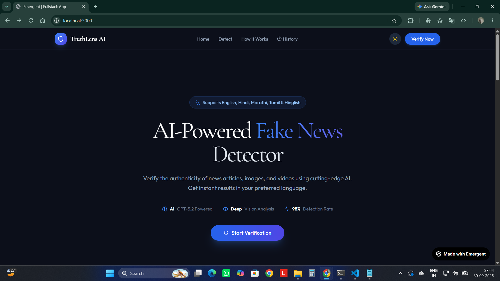
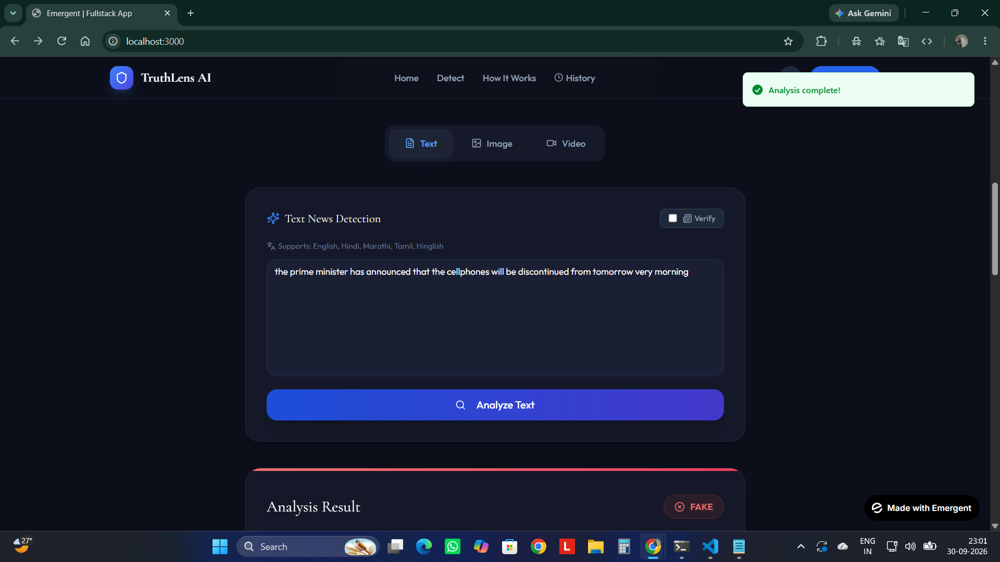
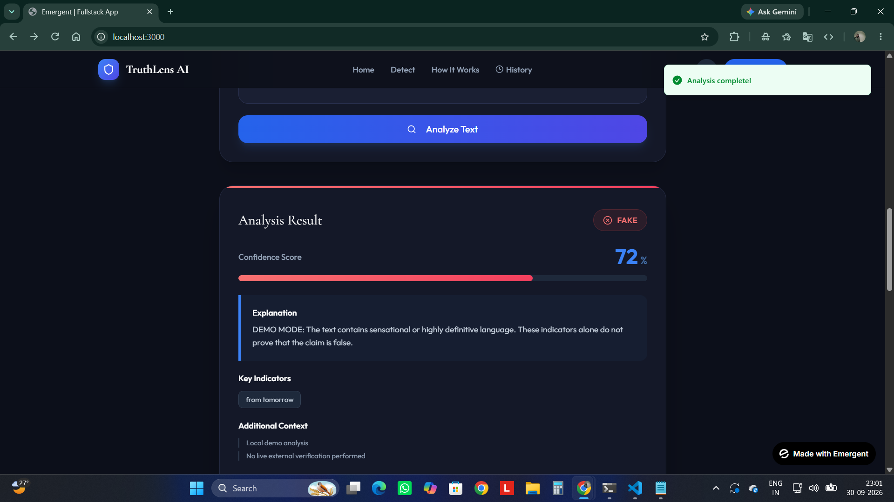
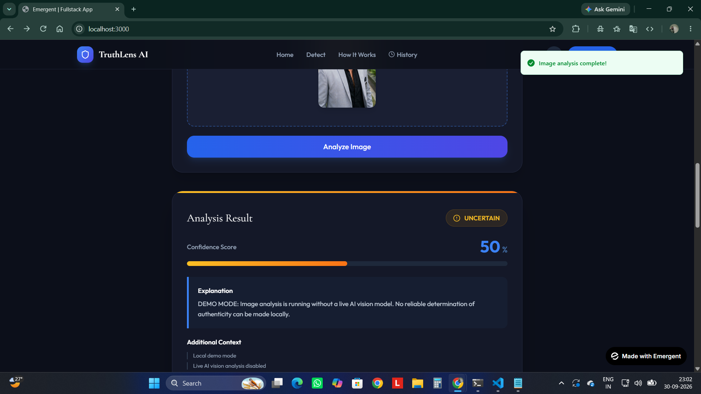
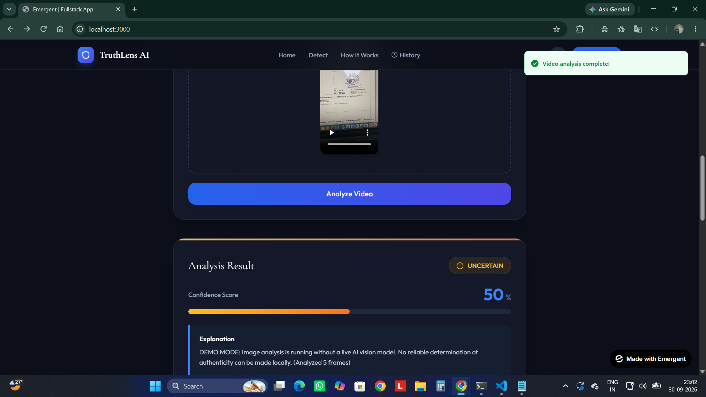
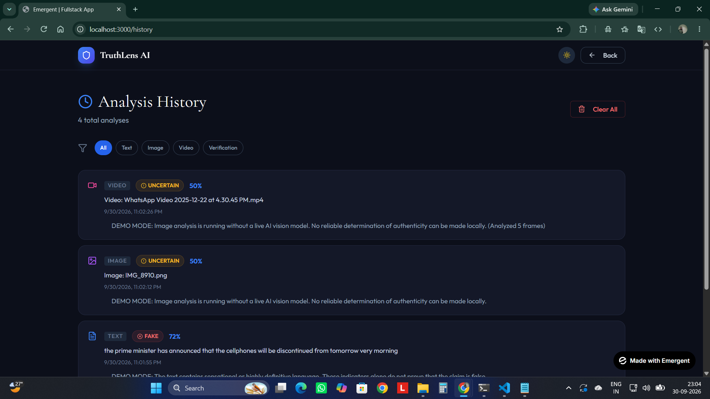

# AI-Assisted Fake News Detector

A full-stack web application for analyzing potentially misleading news content using AI-assisted text and media analysis.

The application supports text, image, and video analysis, claim verification, confidence scores, explanations, multilingual input, and analysis history. A local Demo Mode is also included so the application workflow can be demonstrated without a live OpenAI API call.

## Live Demo

**Frontend:** https://mainkrsna-dot.github.io/project1_AI_powerd_fake_news_detection/

> **Deployment:** The React frontend is hosted on GitHub Pages and the FastAPI backend is deployed on Render. The public deployment currently runs in Demo Mode, so the complete application workflow is available without requiring paid OpenAI API credits.

## Screenshots

### Home / Hero



### Text Analysis



### Text Analysis Result



### Image Analysis



### Video Analysis



### Analysis History



## Features

- **Text Analysis** — Analyze news articles or claims with AI-assisted classification, confidence scores, and explanations.
- **Image Analysis** — Upload news-related images and analyze visible and contextual information.
- **Video Analysis** — Upload videos, extract representative frames, and analyze the extracted visual content.
- **Claim Verification** — Submit a specific claim for AI-assisted verification.
- **Analysis History** — View, filter, and delete previous analyses.
- **Multilingual Input** — Supports English, Hindi, Marathi, Tamil, and Hinglish workflows.
- **Demo Mode** — Local fallback analysis when a live OpenAI API call is unavailable.
- **Responsive UI** — React-based interface with dark mode and drag-and-drop file upload.

## How It Works

```text
User
 |
 v
React Frontend
 |
 | HTTP / REST API
 v
FastAPI Backend
 |
 +-- Text Analysis
 +-- Image Analysis
 +-- Video Analysis
 +-- Claim Verification
 +-- Analysis History
       |
       +-- OpenAI API (normal mode)
       +-- MongoDB (normal mode)
       +-- In-memory history (Demo Mode)
```

## Tech Stack

### Frontend

- React
- React Router
- Axios
- CRACO
- Tailwind CSS
- JavaScript

### Backend

- Python
- FastAPI
- Uvicorn
- OpenAI API
- Pydantic
- python-dotenv
- MongoDB (normal mode)
- In-memory storage (Demo Mode)

## Project Structure

```text
project1_AI_powerd_fake_news_detection/
├── .github/
│   └── workflows/
│       └── deploy.yml
├── backend/
│   ├── server.py
│   ├── requirements.txt
│   └── ...
├── frontend/
│   ├── src/
│   ├── public/
│   ├── package.json
│   └── ...
├── screenshots/
│   ├── home.png
│   ├── text-analysis.png
│   ├── text-analysis-result.png
│   ├── image-analysis.png
│   ├── video-analysis.png
│   └── history.png
└── README.md
```

## Getting Started

### 1. Clone the repository

```bash
git clone https://github.com/mainkrsna-dot/project1_AI_powerd_fake_news_detection.git
cd project1_AI_powerd_fake_news_detection
```

### 2. Backend

```bash
cd backend
python -m venv venv
venv\Scripts\activate
pip install -r requirements.txt
uvicorn server:app --reload
```

The backend runs on:

```text
http://127.0.0.1:8000
```

### 3. Frontend

Open a second terminal:

```bash
cd frontend
npm install --legacy-peer-deps
npm start
```

The frontend runs on:

```text
http://localhost:3000
```

## Demo Mode

Demo Mode provides local fallback responses when a live OpenAI API call is unavailable. It allows the main application workflow, UI, result cards, and history functionality to be demonstrated without requiring paid API credits.

Demo Mode is intended for development and demonstration; its classifications are not equivalent to live external AI analysis.

## API Capabilities

The FastAPI backend provides endpoints for:

- Text detection
- Image detection
- Video detection
- Claim verification
- Analysis history
- News API configuration/status
- Batch image analysis
- Batch video analysis

## Deployment

The React frontend is deployed to GitHub Pages using GitHub Actions. The workflow builds the application from `frontend/` and publishes the generated production build.

The FastAPI backend is deployed separately on Render and is connected to the GitHub Pages frontend through the production API URL.

## Important Note

This project is an **AI-assisted analysis tool**, not a guaranteed factual truth engine. Confidence scores and classifications should be treated as analysis signals rather than definitive proof that a news claim is true or false.

## Future Improvements

- Enable live OpenAI analysis with production API configuration.
- Add external fact-checking and news-source verification.
- Improve model evaluation with a labeled benchmark dataset.
- Add authentication and persistent user-specific history.
